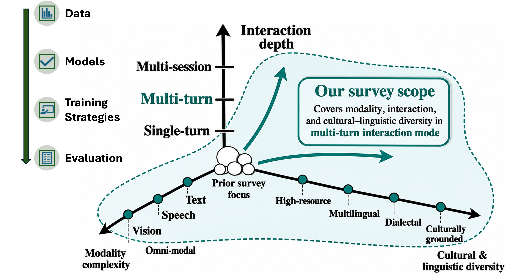

# Multi-turn Conversational AI: From Text to Multimodal Interaction

<p align="center">
  
</p>

> **"Multi-turn Conversational AI from Text to Multimodal Interaction: Data, Models, Evaluation, and Open Challenges"**  

This repository is the companion resource for our survey paper. It lists all papers covered across **datasets, benchmarks, models, training strategies, and evaluation frameworks** for multi-turn conversational AI, organized by the same structure as the paper.

---

## 📋 Table of Contents

- [📊 Datasets](#-datasets)
  - [Text-only](#text-only)
  - [Spoken / Audio](#spoken--audio)
  - [Multimodal (Image + Text)](#multimodal-image--text)
  - [Video](#video)
  - [Cultural & Linguistic](#cultural--linguistic)
- [🏆 Benchmarks](#-benchmarks)
  - [General Multi-turn Instruction Following](#general-multi-turn-instruction-following)
  - [Multilingual & Cross-lingual](#multilingual--cross-lingual)
  - [Multimodal](#multimodal-benchmarks)
  - [Spoken & Video](#spoken--video-benchmarks)
  - [Robustness, Fairness & Safety](#robustness-fairness--safety)
- [🤖 Models](#-models)
  - [Classical & Pre-LLM](#classical--pre-llm)
  - [Instruction-tuned LLMs](#instruction-tuned-llms)
  - [Long-context & Memory Architectures](#long-context--memory-architectures)
  - [AudioLLMs](#audiollms)
  - [Omni-modal Models](#omni-modal-models)
  - [Multi-turn-aware Multimodal Methods](#multi-turn-aware-multimodal-methods)
  - [Agentic & Tool-augmented Systems](#agentic--tool-augmented-systems)
- [🎓 Training Strategies](#-training-strategies)
- [📏 Evaluation Metrics & Frameworks](#-evaluation-metrics--frameworks)
- [🌍 Related Surveys](#-related-surveys)
- [📖 Citation](#-citation)

---

## 📊 Datasets

### Text-only

| Dataset | Paper | Venue | Year |
|---------|-------|-------|------|
| **LongMemEval** | [LongMemEval: Benchmarking Chat Assistants on Long-Term Interactive Memory](https://openreview.net/forum?id=pZiyCaVuti) | ICLR | 2025 |
| **MultiChallenge** | [MultiChallenge: A Realistic Multi-Turn Evaluation Benchmark](https://aclanthology.org/2025.findings-acl.958/) | ACL-F | 2025 |
| **τ-Bench** | [τ-Bench: A Benchmark for Tool-Agent-User Interaction](https://openreview.net/forum?id=roNSXZpUDN) | ICLR | 2025 |
| **PersonaMem** | [Know Me, Respond to Me](https://openreview.net/forum?id=6ox8XZGOqP) | COLM | 2025 |
| **ConsistentChat** | [ConsistentChat: Skeleton-Guided Consistent Multi-Turn Dialogues](https://aclanthology.org/2025.emnlp-main.424.pdf) | EMNLP | 2025 |
| **DocTalk** | [DocTalk: Scalable Graph-Based Dialogue Synthesis](https://aclanthology.org/2025.sigdial-1.53.pdf) | SIGDIAL | 2025 |
| **ToolWOZ** | [Sparse Rewards Can Self-Train Dialogue Agents](https://aclanthology.org/2025.findings-acl.1302/) | ACL-F | 2025 |
| **WildChat** | [WildChat: 1M ChatGPT Interaction Logs in the Wild](https://openreview.net/forum?id=Bl8u7ZRlbM) | ICLR | 2024 |
| **MT-Bench-101** | [MT-Bench-101: Fine-Grained Benchmark](https://aclanthology.org/2024.acl-long.401/) | ACL | 2024 |
| **MT-Eval** | [MT-Eval: A Multi-Turn Capabilities Evaluation Benchmark](https://aclanthology.org/2024.emnlp-main.1124/) | EMNLP | 2024 |
| **PRODIGy** | [PRODIGy: A Profile-Based Dialogue Generation Dataset](https://aclanthology.org/2024.findings-naacl.222/) | NAACL-F | 2024 |
| **LMSYS-Chat-1M** | [LMSYS-Chat-1M: A Large-Scale Real-World LLM Conversation Dataset](https://openreview.net/forum?id=BOfDKxfwt0) | ICLR | 2024 |
| **SOTOPIA** | [SOTOPIA: Interactive Evaluation for Social Intelligence](https://openreview.net/forum?id=mM7VurbA4r) | ICLR | 2024 |
| **DialSim** | [DialSim: A Real-Time Simulator for Long-Term Dialogue Understanding](https://arxiv.org/abs/2406.13144) | arXiv | 2024 |
| **PIPPA** | [PIPPA: A Partially Synthetic Conversational Dataset](https://arxiv.org/abs/2308.05884) | arXiv | 2023 |
| **UltraChat** | [Enhancing Chat LMs by Scaling Instructional Conversations](https://aclanthology.org/2023.emnlp-main.183/) | EMNLP | 2023 |
| **MT-Bench** | [Judging LLM-as-a-Judge with MT-Bench](https://arxiv.org/abs/2306.05685) | NeurIPS | 2023 |
| **MultiWOZ 2.1** | [MultiWOZ 2.1](https://aclanthology.org/2020.lrec-1.53/) | LREC | 2020 |
| **CoQA** | [CoQA: A Conversational QA Challenge](https://aclanthology.org/Q19-1016/) | TACL | 2019 |
| **PersonaChat** | [Personalizing Dialogue Agents](https://aclanthology.org/P18-1205/) | ACL | 2018 |

### Spoken / Audio

| Dataset | Paper | Venue | Year |
|---------|-------|-------|------|
| **MENASpeechBank** | [MENASpeechBank: A Reference Voice Bank for AudioLLMs](https://arxiv.org/abs/2602.07036) | arXiv | 2026 |
| **DeepDialogue** | [DeepDialogue: A Multi-Turn Emotionally-Rich Spoken Dialogue Dataset](https://arxiv.org/abs/2505.19978) | arXiv | 2025 |
| **Audio MultiChallenge** | [Audio MultiChallenge: A Multi-Turn Evaluation of Spoken Dialogue Systems](https://arxiv.org/abs/2512.14865) | arXiv | 2025 |
| **C3** | [C3: A Bilingual Benchmark for Spoken Dialogue Models](https://arxiv.org/abs/2507.22968) | EMNLP | 2025 |
| **ASK-QA** | [Data-Centric Improvements for Multi-Modal Understanding in Spoken Conversation](https://aclanthology.org/2025.findings-acl.71/) | ACL-F | 2025 |
| **MULTI-Bench** | [Multi-Bench: A Multi-Turn Interactive Benchmark for Emotional Intelligence](https://arxiv.org/abs/2511.00850) | arXiv | 2025 |
| **MSIB** | [InteractiveOmni: Unified Omni-Modal Model for Audio-Visual Multi-Turn Dialogue](https://arxiv.org/abs/2510.13747) | arXiv | 2025 |
| **SpokenWOZ** | [SpokenWOZ: A Large-Scale Speech-Text Benchmark for Spoken TOD](https://arxiv.org/abs/2305.13040) | NeurIPS | 2023 |

### Multimodal (Image + Text)

| Dataset | Paper | Venue | Year |
|---------|-------|-------|------|
| **MEM-Gallery** | [MEM-Gallery: Benchmarking Multimodal Long-Term Conversational Memory](https://arxiv.org/abs/2601.03515) | arXiv | 2026 |
| **TMDialog** | [ContextQFormer: A New Context Modeling Method for Multi-Turn Multi-Modal Conversations](https://arxiv.org/abs/2505.23121) | arXiv | 2025 |
| **CB-300K** | [Chatterbox: Multimodal Referring and Grounding with Chain-of-Questions](https://arxiv.org/abs/2401.13307) | AAAI | 2025 |
| **MMDiag** | [Taking Notes Brings Focus? Towards Multi-Turn Multimodal Dialogue Learning](https://aclanthology.org/2025.emnlp-main.1690/) | EMNLP | 2025 |
| **MultiVerse** | [MultiVerse: A Multi-Turn Conversation Benchmark for LVLMs](https://arxiv.org/abs/2407.09709) | ICCV | 2025 |
| **MMRC** | [MMRC: A Large-Scale Benchmark for Understanding MLLM in Real-World Conversation](https://aclanthology.org/2025.acl-long.1096/) | ACL | 2025 |
| **AlignMMBench** | [AlignMMBench: Evaluating Chinese Multimodal Alignment](https://arxiv.org/abs/2406.09295) | ACL | 2025 |
| **MMMB** | [InteractiveOmni: Unified Omni-Modal Model for Audio-Visual Multi-Turn Dialogue](https://arxiv.org/abs/2510.13747) | arXiv | 2025 |
| **DialogBen** | [DialogGen: Multi-Modal Interactive Dialogue System](https://aclanthology.org/2025.findings-naacl.25/) | NAACL-F | 2025 |
| **IMAD** | [IMAD: Image-Augmented Multi-Modal Dialogue](https://arxiv.org/abs/2305.10512) | arXiv | 2024 |
| **DialogCC** | [DialogCC: An Automated Pipeline for High-Quality Multi-Modal Dialogue](https://aclanthology.org/2024.naacl-long.108.pdf) | NAACL | 2024 |
| **LoCoMo** | [Evaluating Very Long-Term Conversational Memory of LLM Agents](https://aclanthology.org/2024.acl-long.747.pdf) | ACL | 2024 |
| **MMDU-45K** | [MMDU: A Multi-Turn Multi-Image Dialog Understanding Benchmark](https://arxiv.org/abs/2406.11833) | NeurIPS | 2024 |
| **ConvBench** | [ConvBench: A Multi-Turn Conversation Evaluation Benchmark](https://arxiv.org/abs/2403.20194) | NeurIPS | 2024 |
| **MMMT-IF** | [MMMT-IF: A Challenging Multimodal Multi-Turn Instruction Following Benchmark](https://arxiv.org/abs/2409.18216) | arXiv | 2024 |
| **MMDialog** | [MMDialog: A Large-Scale Multi-Turn Dialogue Dataset](https://aclanthology.org/2023.acl-long.405/) | ACL | 2023 |
| **InfoVisDial** | [InfoVisDial: An Informative Visual Dialogue Dataset](https://arxiv.org/abs/2312.13503) | arXiv | 2023 |
| **VisDial** | [Visual Dialog](https://openaccess.thecvf.com/content_cvpr_2017/papers/Das_Visual_Dialog_CVPR_2017_paper.pdf) | CVPR | 2017 |

### Video

| Dataset | Paper | Venue | Year |
|---------|-------|-------|------|
| **CogStream** | [CogStream: Context-Guided Streaming Video Question Answering](https://arxiv.org/abs/2506.10516) | AAAI | 2026 |
| **MT-Video-Bench** | [MT-Video-Bench: A Holistic Video Understanding Benchmark](https://arxiv.org/abs/2510.17722) | arXiv | 2025 |
| **OmniMMI** | [OmniMMI: A Comprehensive Multi-Modal Interaction Benchmark](https://openaccess.thecvf.com/content/CVPR2025/papers/Wang_OmniMMI_A_Comprehensive_Multi-modal_Interaction_Benchmark_in_Streaming_Video_Contexts_CVPR_2025_paper.pdf) | CVPR | 2025 |
| **SCVBench** | [SCVBench: A Benchmark with Multi-Turn Dialogues for Story-Centric Video Understanding](https://www.ijcai.org/proceedings/2025/0255.pdf) | IJCAI | 2025 |
| **SVBench** | [SVBench: A Benchmark with Temporal Multi-Turn Dialogues for Streaming Video Understanding](https://arxiv.org/abs/2502.10810) | ICLR | 2025 |
| **IVCR-200K** | [IVCR-200k: A Large-Scale Benchmark for Interactive Video Corpus Retrieval](https://openreview.net/forum?id=Dojny642Dy&referrer=%5Bthe%20profile%20of%20Dun%20Tan%5D(%2Fprofile%3Fid%3D~Dun_Tan1) | arXiv | 2024 |

### Cultural & Linguistic

| Dataset | Paper | Venue | Year | MT? |
|---------|-------|-------|------|-----|
| **MMA-ASIA** ⋆ | [MMA-ASIA: A Multilingual and Multimodal Alignment Framework](https://openreview.net/forum?id=iYVh7UKmfn) | arXiv | 2025 | Single-turn |
| **OASIS** ⋆ | [EverydayMMQA: A Multilingual and Multimodal Framework for Culturally Grounded Spoken Visual QA](https://arxiv.org/abs/2510.06371) | arXiv | 2025 | Single-turn |
| **Shawarma Chats** | [Shawarma Chats: A Benchmark in Egyptian, Maghrebi & MSA Arabic](https://aclanthology.org/2025.arabicnlp-main.39/) | ArabicNLP | 2025 | Multi-turn |
| **CVQA** ⋆ | [CVQA: Culturally-Diverse Multilingual VQA Benchmark](https://arxiv.org/abs/2406.05967) | NeurIPS | 2024 | Single-turn |
| **Dallah** ⋆ | [Dallah: A Dialect-Aware Multimodal LLM for Arabic](https://aclanthology.org/2024.arabicnlp-1.27/) | ACL-ArabicNLP | 2024 | Single-turn |

> ⋆ = single-turn; included as cultural/cross-lingual baselines.

---

## 🏆 Benchmarks

### General Multi-turn Instruction Following

| Benchmark | Paper | Venue | Year |
|-----------|-------|-------|------|
| **TurnWise** | [TurnWise: The Gap Between Single- and Multi-Turn LM Capabilities](https://arxiv.org/abs/2603.16759) | arXiv | 2026 |
| **MultiChallenge** | [MultiChallenge: A Realistic Multi-Turn Evaluation Benchmark](https://aclanthology.org/2025.findings-acl.958/) | ACL-F | 2025 |
| **IHEval** | [IHEval: Evaluating LMs on Following the Instruction Hierarchy](https://arxiv.org/abs/2502.08745) | NAACL | 2025 |
| **TOD-ProcBench** | [TOD-ProcBench: Benchmarking Complex Instruction-Following in TOD](https://assets.amazon.science/db/5a/053b8cb943c2929de3639ab24055/recsys2025-workshops-paper-212-camera-ready-1.pdf) | NeurIPS-W | 2025 |
| **EvolIF** | [One Battle After Another: Probing LLMs' Limits on Multi-Turn Instruction Following](https://arxiv.org/abs/2511.03508) | arXiv | 2025 |
| **τ-Bench** | [τ-Bench: A Benchmark for Tool-Agent-User Interaction](https://openreview.net/forum?id=roNSXZpUDN) | ICLR | 2025 |
| **StructFlowBench** | [StructFlowBench: A Structured Flow Benchmark for Multi-Turn Instruction Following](https://aclanthology.org/2025.findings-acl.486.pdf) | ACL-F | 2025 |
| **PersonaMem** | [Know Me, Respond to Me](https://openreview.net/forum?id=6ox8XZGOqP) | COLM | 2025 |
| **CORAL** | [CORAL: Benchmarking Multi-Turn Conversational RAG](https://aclanthology.org/2025.findings-naacl.72/) | NAACL-F | 2025 |
| **ToolSandbox** | [ToolSandbox: A Stateful, Conversational Evaluation for LLM Tool Use](https://aclanthology.org/2025.findings-naacl.65.pdf) | NAACL-F | 2025 |
| **TurnBench-MS** | [TurnBench-MS: A Benchmark for Evaluating Multi-Turn, Multi-Step Reasoning](https://aclanthology.org/2025.findings-emnlp.1084/) | EMNLP-F | 2025 |
| **MemoryAgentBench** | [Evaluating Memory in LLM Agents via Incremental Multi-Turn Interactions](https://arxiv.org/abs/2507.05257) | ICML-W | 2025 |
| **MT-Bench-101** | [MT-Bench-101: Fine-Grained Benchmark for Multi-Turn Dialogues](https://aclanthology.org/2024.acl-long.401/) | ACL | 2024 |
| **MT-Eval** | [MT-Eval: A Multi-Turn Capabilities Evaluation Benchmark](https://aclanthology.org/2024.emnlp-main.1124/) | EMNLP | 2024 |
| **Parrot-Bench** | [Parrot: Enhancing Multi-Turn Instruction Following for LLMs](https://aclanthology.org/2024.acl-long.525/) | ACL | 2024 |
| **MINT** | [MINT: Evaluating LLMs in Multi-Turn Interaction with Tools and Language Feedback](https://openreview.net/forum?id=jp3gWrMuIZ) | ICLR | 2024 |
| **SOTOPIA** | [SOTOPIA: Interactive Evaluation for Social Intelligence in Language Agents](https://openreview.net/forum?id=mM7VurbA4r) | ICLR | 2024 |
| **AgentBoard** | [AgentBoard: An Analytical Evaluation Board of Multi-Turn LLM Agents](https://arxiv.org/abs/2401.13178) | NeurIPS | 2024 |
| **MT-Bench** | [Judging LLM-as-a-Judge with MT-Bench](https://arxiv.org/abs/2306.05685) | NeurIPS | 2023 |

### Multilingual & Cross-lingual

| Benchmark | Paper | Venue | Year |
|-----------|-------|-------|------|
| **M2Lingual** | [M2Lingual: Enhancing Multilingual, Multi-Turn Instruction Alignment](https://aclanthology.org/2025.naacl-long.489/) | NAACL | 2025 |
| **CMT-Eval** | [CMT-Eval: A Novel Chinese Multi-Turn Dialogue Evaluation Dataset](https://aclanthology.org/2025.findings-emnlp.992/) | EMNLP-F | 2025 |
| **AlignMMBench** | [AlignMMBench: Evaluating Chinese Multimodal Alignment](https://arxiv.org/abs/2406.09295) | ACL | 2025 |
| **MT-Bench-Hi** | [Benchmarking Hindi LLMs](https://aclanthology.org/2025.bhasha-1.5/) | ACL-W | 2025 |
| **cuDialog** | [Bridging Cultural Nuances in Dialogue Agents](https://aclanthology.org/2024.findings-eacl.63/) | EACL-F | 2024 |
| **IndoToD** | [IndoToD: A Multi-Domain Indonesian Benchmark for End-to-End TOD](https://aclanthology.org/2023.sealp-1.7/) | SEALP | 2023 |

### Multimodal Benchmarks

| Benchmark | Paper | Venue | Year |
|-----------|-------|-------|------|
| **MEM-Gallery** | [MEM-Gallery: Benchmarking Multimodal Long-Term Conversational Memory](https://arxiv.org/abs/2601.03515) | arXiv | 2026 |
| **MMCR** | [MMCR: Advancing VLM in Multimodal Multi-Turn Contextual Reasoning](https://arxiv.org/abs/2503.18533) | arXiv | 2025 |
| **MMRC** | [MMRC: A Large-Scale Benchmark for Understanding MLLM in Real-World Conversation](https://aclanthology.org/2025.acl-long.1096/) | ACL | 2025 |
| **MultiVerse** | [MultiVerse: A Multi-Turn Conversation Benchmark for LVLMs](https://arxiv.org/abs/2407.09709) | ICCV | 2025 |
| **MMMB** | [InteractiveOmni: Unified Omni-Modal Model for Audio-Visual Multi-Turn Dialogue](https://arxiv.org/abs/2510.13747) | arXiv | 2025 |
| **ConvBench** | [ConvBench: A Multi-Turn Conversation Evaluation Benchmark for LVLMs](https://arxiv.org/abs/2403.20194) | NeurIPS | 2024 |
| **MMDU** | [MMDU: A Multi-Turn Multi-Image Dialog Understanding Benchmark](https://arxiv.org/abs/2406.11833) | NeurIPS | 2024 |
| **MMMT-IF** | [MMMT-IF: A Challenging Multimodal Multi-Turn Instruction Following Benchmark](https://arxiv.org/abs/2409.18216) | arXiv | 2024 |

### Spoken & Video Benchmarks

| Benchmark | Paper | Venue | Year |
|-----------|-------|-------|------|
| **CogStream** | [CogStream: Context-Guided Streaming Video QA](https://arxiv.org/abs/2506.10516) | AAAI | 2026 |
| **Audio MultiChallenge** | [Audio MultiChallenge: A Multi-Turn Evaluation of Spoken Dialogue Systems](https://arxiv.org/abs/2512.14865) | arXiv | 2025 |
| **MT-Video-Bench** | [MT-Video-Bench: A Holistic Video Understanding Benchmark](https://arxiv.org/abs/2510.17722) | arXiv | 2025 |
| **OmniMMI** | [OmniMMI: A Comprehensive Multi-Modal Interaction Benchmark in Streaming Video](https://openaccess.thecvf.com/content/CVPR2025/papers/Wang_OmniMMI_A_Comprehensive_Multi-modal_Interaction_Benchmark_in_Streaming_Video_Contexts_CVPR_2025_paper.pdf) | CVPR | 2025 |
| **SCVBench** | [SCVBench: A Benchmark with Multi-Turn Dialogues for Story-Centric Video Understanding](https://arxiv.org/abs/2409.12638) | IJCAI | 2025 |
| **AVHBench** | [AVHBench: A Cross-Modal Hallucination Benchmark for Audio-Visual LLMs](https://openreview.net/forum?id=jTEKTdI3K9) | ICLR | 2025 |
| **MTalk-Bench** | [MTalk-Bench: Evaluating Speech-to-Speech Models in Multi-Turn Dialogues](https://arxiv.org/abs/2508.18240) | arXiv | 2025 |
| **FD-Bench** | [FD-Bench: A Full-Duplex Benchmarking Pipeline for Full-Duplex Spoken Dialogue Systems](https://arxiv.org/abs/2507.19040) | Interspeech | 2025 |
| **MULTI-Bench** | [Multi-Bench: A Multi-Turn Interactive Benchmark for Emotional Intelligence](https://arxiv.org/abs/2511.00850) | arXiv | 2025 |
| **SVBench** | [SVBench: A Benchmark with Temporal Multi-Turn Dialogues for Streaming Video](https://arxiv.org/abs/2502.10810) | ICLR | 2025 |
| **MSIB** | [InteractiveOmni: Unified Omni-Modal Model for Audio-Visual Multi-Turn Dialogue](https://arxiv.org/abs/2510.13747) | arXiv | 2025 |

### Robustness, Fairness & Safety

| Benchmark | Paper | Venue | Year |
|-----------|-------|-------|------|
| **Curse of Multi-Modalities** | [The Curse of Multi-Modalities: Evaluating Hallucinations](https://arxiv.org/abs/2410.12787) | NeurIPS | 2026 |
| **Lost in Multi-Turn** | [LLMs Get Lost in Multi-Turn Conversation](https://openreview.net/forum?id=VKGTGGcwl6) | ICLR | 2026 |
| **SafeDialBench** | [SafeDialBench: A Fine-Grained Safety Evaluation Benchmark](https://openreview.net/forum?id=KFjtRqVnKH) | ICLR | 2026 |
| **FB-Bench** | [FB-Bench: Evaluating LLMs Responsiveness to Human Feedback](https://aclanthology.org/2025.emnlp-main.471/) | EMNLP | 2025 |
| **FairMT-Bench** | [FairMT-Bench: Benchmarking Fairness for Multi-Turn Dialogue](https://openreview.net/forum?id=RSGoXnS9GH) | ICLR | 2025 |
| **SYCON-Bench** | [Measuring Sycophancy of LMs in Multi-Turn Dialogues](https://aclanthology.org/2025.findings-emnlp.121/) | EMNLP-F | 2025 |
| **X-Teaming** | [X-Teaming: Multi-Turn Jailbreaks and Defenses with Adaptive Multi-Agents](https://arxiv.org/abs/2504.13203) | arXiv | 2025 |
| **Crescendo** | [The Crescendo Multi-Turn LLM Jailbreak Attack](https://www.usenix.org/conference/usenixsecurity25/presentation/russinovich) | USENIX Security | 2025 |
| **DiaHalu** | [DiaHalu: A Dialogue-Level Hallucination Evaluation Benchmark](https://aclanthology.org/2024.findings-emnlp.529/) | EMNLP-F | 2024 |

---

## 🤖 Models

### Classical & Pre-LLM

| Model | Paper | Venue | Year |
|-------|-------|-------|------|
| **PPTOD** | [Multi-Task Pre-Training for Plug-and-Play Task-Oriented Dialogue System](https://aclanthology.org/2022.acl-long.319/) | ACL | 2022 |
| **BlenderBot** | [Recipes for Building an Open-Domain Chatbot](https://aclanthology.org/2021.eacl-main.24/) | EACL | 2021 |
| **DialoGPT** | [DialoGPT: Large-Scale Generative Pre-Training for Conversational Response Generation](https://aclanthology.org/2020.acl-demos.30/) | ACL | 2020 |
| **PLATO** | [PLATO: Pre-Trained Dialogue Generation Model with Discrete Latent Variable](https://aclanthology.org/2020.acl-main.9/) | ACL | 2020 |
| **TOD-BERT** | [TOD-BERT: Pre-Trained Natural Language Understanding for TOD](https://aclanthology.org/2020.emnlp-main.66/) | EMNLP | 2020 |
| **TurnGPT** | [TurnGPT: A Transformer-Based LM for Predicting Turn-Taking](https://aclanthology.org/2020.findings-emnlp.268/) | EMNLP-F | 2020 |

### Instruction-tuned LLMs

| Model | Paper | Venue | Year |
|-------|-------|-------|------|
| **COMEDY** | [Compress to Impress: Unleashing Compressive Memory in Long-Term Conversations](https://aclanthology.org/2025.coling-main.51/) | COLING | 2025 |
| **UniConv** | [UniConv: Unifying Retrieval and Response Generation for LLMs in Conversations](https://aclanthology.org/2025.acl-long.344.pdf) | ACL | 2025 |
| **FnCTOD** | [LLMs as Zero-Shot Dialogue State Tracker through Function Calling](https://aclanthology.org/2024.acl-long.471.pdf) | ACL | 2024 |
| **ChatQA** | [ChatQA: Surpassing GPT-4 on Conversational QA and RAG](https://arxiv.org/abs/2401.10225) | NeurIPS | 2024 |
| **InstructGPT** | [Training LMs to Follow Instructions with Human Feedback](https://arxiv.org/abs/2203.02155) | NeurIPS | 2022 |

### Long-context & Memory Architectures

| Model | Paper | Venue | Year |
|-------|-------|-------|------|
| **MemBART** | [Stateful Memory-Augmented Transformers for Efficient Dialogue Modeling](https://aclanthology.org/2024.findings-eacl.57.pdf) | EACL-F | 2024 |
| **CCM** | [Compressed Context Memory for Online LM Interaction](https://openreview.net/forum?id=64kSvC4iPg) | ICLR | 2024 |
| **RWKV** | [RWKV: Reinventing RNNs for the Transformer Era](https://aclanthology.org/2023.findings-emnlp.936/) | EMNLP-F | 2023 |
| **RMT** | [Recurrent Memory Transformer](https://arxiv.org/abs/2207.06881) | NeurIPS | 2022 |
| **Transformer-XL** | [Transformer-XL: Attentive Language Models Beyond a Fixed-Length Context](https://aclanthology.org/P19-1285/) | ACL | 2019 |

### AudioLLMs

| Model | Paper | Venue | Year | Full-Duplex |
|-------|-------|-------|------|-------------|
| **Freeze-Omni** | [Freeze-Omni: A Smart and Low-Latency Speech-to-Speech Dialogue Model](https://arxiv.org/abs/2411.00774) | ICML | 2025 | ✓ |
| **MinMo** | [MinMo: A Multimodal LLM for Seamless Voice Interaction](https://arxiv.org/abs/2501.06282) | arXiv | 2025 | ✓ |
| **LLaMA-Omni 2** | [LLaMA-Omni 2: LLM-Based Real-Time Spoken Chatbot with Autoregressive Streaming Speech Synthesis](https://aclanthology.org/2025.acl-long.912.pdf) | ACL | 2025 | ✓ |
| **SpiRit-LM** | [SpiRit-LM: Interleaved Spoken and Written Language Model](https://aclanthology.org/2025.tacl-1.2/) | TACL | 2025 | ✗ |
| **SLAM-Omni** | [SLAM-Omni: Timbre-Controllable Voice Interaction System](https://aclanthology.org/2025.findings-acl.115.pdf) | ACL-F | 2025 | ✓ |
| **SALMONN** | [SALMONN: Towards Generic Hearing Abilities for Large LMs](https://openreview.net/forum?id=14rn7HpKVk) | ICLR | 2024 | ✗ |
| **Qwen2-Audio** | [Qwen2-Audio Technical Report](https://arxiv.org/abs/2407.10759) | arXiv | 2024 | ✗ |
| **Moshi** | [Moshi: A Speech-Text Foundation Model for Real-Time Dialogue](https://arxiv.org/abs/2410.00037) | arXiv | 2024 | ✓ |
| **Mini-Omni** | [Mini-Omni: Language Models Can Hear, Talk While Thinking in Streaming](https://arxiv.org/abs/2408.16725) | arXiv | 2024 | ✓ |
| **GLM-4-Voice** | [GLM-4-Voice: Towards Intelligent and Human-Like End-to-End Spoken Chatbot](https://arxiv.org/abs/2412.02612) | arXiv | 2024 | ✓ |
| **SpeechGPT** | [SpeechGPT: Empowering LLMs with Intrinsic Cross-Modal Conversational Abilities](https://aclanthology.org/2023.findings-emnlp.1055/) | EMNLP-F | 2023 | ✗ |
| **Qwen-Audio** | [Qwen-Audio: Advancing Universal Audio Understanding](https://arxiv.org/abs/2311.07919) | arXiv | 2023 | ✗ |
| **AudioPaLM** | [AudioPaLM: A Large Language Model That Can Speak and Listen](https://arxiv.org/abs/2306.12925) | arXiv | 2023 | ✗ |
| **dGSLM** | [Generative Spoken Dialogue Language Modeling](https://aclanthology.org/2023.tacl-1.15/) | TACL | 2023 | ✗ |

### Omni-modal Models

| Model | Paper | Venue | Year |
|-------|-------|-------|------|
| **VITA-1.5** | [VITA-1.5: Towards GPT-4o Level Real-Time Vision and Speech Interaction](https://arxiv.org/abs/2501.01957) | NeurIPS | 2026 |
| **Qwen2.5-Omni** | [Qwen2.5-Omni Technical Report](https://arxiv.org/abs/2503.20215) | arXiv | 2025 |
| **InteractiveOmni** | [InteractiveOmni: Unified Omni-Modal Model for Audio-Visual Multi-Turn Dialogue](https://arxiv.org/abs/2510.13747) | arXiv | 2025 |
| **EMOVA** | [EMOVA: Empowering Language Models to See, Hear and Speak with Vivid Emotions](https://arxiv.org/abs/2409.18042) | CVPR | 2025 |
| **Stream-Omni** | [Stream-Omni: Simultaneous Multimodal Interactions](https://arxiv.org/abs/2506.13642) | arXiv | 2025 |
| **M2-Omni** | [M2-Omni: Advancing Omni-MLLM for Comprehensive Modality Support](https://arxiv.org/abs/2502.18778) | arXiv | 2025 |
| **MIO** | [MIO: A Foundation Model on Multimodal Tokens](https://aclanthology.org/2025.emnlp-main.255/) | EMNLP | 2025 |
| **Vision-Speech** | [Vision-Speech Models: Teaching Speech Models to Converse About Images](https://arxiv.org/abs/2503.15633) | arXiv | 2025 |
| **GPT-4o** | [GPT-4o System Card](https://arxiv.org/abs/2410.21276) | OpenAI | 2024 |
| **IXC2.5-OmniLive** | [InternLM-XComposer2.5-OmniLive](https://arxiv.org/abs/2412.09596) | arXiv | 2024 |
| **Mini-Omni2** | [Mini-Omni2: Towards Open-Source GPT-4o with Vision, Speech and Duplex](https://arxiv.org/abs/2410.11190) | arXiv | 2024 |
| **Baichuan-Omni** | [Baichuan-Omni Technical Report](https://arxiv.org/abs/2410.08565) | arXiv | 2024 |

### Multi-turn-aware Multimodal Methods

| Model | Paper | Venue | Year |
|-------|-------|-------|------|
| **ContextQFormer** | [ContextQFormer: A New Context Modeling Method for Multi-Turn Multi-Modal Conversations](https://arxiv.org/abs/2505.23121) | arXiv | 2025 |
| **MadaKV** | [MadaKV: Adaptive Modality-Perception KV Cache Eviction](https://aclanthology.org/2025.acl-long.652/) | ACL | 2025 |
| **DiagNote** | [Taking Notes Brings Focus? Towards Multi-Turn Multimodal Dialogue Learning](https://aclanthology.org/2025.emnlp-main.1690/) | EMNLP | 2025 |
| **DialogGen** | [DialogGen: Multi-Modal Interactive Dialogue System with Multi-Turn Text-Image Generation](https://aclanthology.org/2025.findings-naacl.25/) | NAACL-F | 2025 |

### Agentic & Tool-augmented Systems

| Model | Paper | Venue | Year |
|-------|-------|-------|------|
| **VideoMind** | [VideoMind: A Chain-of-LoRA Agent for Temporal-Grounded Video Reasoning](https://openreview.net/forum?id=57EwidOnSf) | ICLR | 2026 |
| **SAPIENT** | [SAPIENT: Mastering Multi-Turn Conversational Recommendation with MCTS](https://aclanthology.org/2025.naacl-long.133/) | NAACL | 2025 |
| **MetaGPT** | [MetaGPT: Meta Programming for a Multi-Agent Collaborative Framework](https://openreview.net/forum?id=VtmBAGCN7o) | ICLR | 2024 |
| **ToolPlanner** | [ToolPlanner: A Tool Augmented LLM for Multi-Granularity Instructions](https://aclanthology.org/2024.emnlp-main.1018.pdf) | EMNLP | 2024 |
| **WebLINX** | [WebLINX: Real-World Website Navigation with Multi-Turn Dialogue](https://arxiv.org/abs/2402.05930) | ICML | 2024 |
| **ReAct** | [ReAct: Synergizing Reasoning and Acting in Language Models](https://openreview.net/forum?id=WE_vluYUL-X) | ICLR | 2023 |
| **Reflexion** | [Reflexion: Language Agents with Verbal Reinforcement Learning](https://arxiv.org/abs/2303.11366) | NeurIPS | 2023 |
| **ChatCoT** | [ChatCoT: Tool-Augmented Chain-of-Thought Reasoning](https://aclanthology.org/2023.findings-emnlp.985/) | EMNLP-F | 2023 |

---

## 🎓 Training Strategies

### Supervised Fine-tuning & Synthetic Data

| Method | Paper | Venue | Year |
|--------|-------|-------|------|
| **ConsistentChat** | [ConsistentChat: Building Skeleton-Guided Consistent Multi-Turn Dialogues](https://aclanthology.org/2025.emnlp-main.424.pdf) | EMNLP | 2025 |
| **DocTalk** | [DocTalk: Scalable Graph-Based Dialogue Synthesis](https://aclanthology.org/2025.sigdial-1.53.pdf)| SIGDIAL | 2025 |
| **ChatQA-2** | [ChatQA 2: Bridging the Gap to Proprietary LLMs in Long Context and RAG](https://openreview.net/forum?id=cPD2hU35x3) | ICLR | 2025 |
| **WildChat** | [WildChat: 1M ChatGPT Interaction Logs in the Wild](https://openreview.net/forum?id=Bl8u7ZRlbM) | ICLR | 2024 |
| **Parrot** | [Parrot: Enhancing Multi-Turn Instruction Following for LLMs](https://aclanthology.org/2024.acl-long.525/) | ACL | 2024 |
| **Aquila-Med** | [Aquila-Med LLM: Full-Process Open-Source Medical LLM](https://arxiv.org/abs/2406.12182) | arXiv | 2024 |
| **Zhongjing** | [Zhongjing: Enhancing Chinese Medical Capabilities](https://arxiv.org/abs/2308.03549) | AAAI | 2024 |
| **ChatQA** | [ChatQA: Surpassing GPT-4 on Conversational QA and RAG](https://arxiv.org/abs/2401.10225) | NeurIPS | 2024 |
| **UltraChat** | [Enhancing Chat LMs by Scaling Instructional Conversations](https://aclanthology.org/2023.emnlp-main.183/) | EMNLP | 2023 |
| **Qilin-Med** | [Qilin-Med: Multi-Stage Knowledge Injection for Medical LLMs](https://arxiv.org/abs/2310.09089) | arXiv | 2023 |

### Reinforcement Learning & Preference Optimization

| Method | Paper | Venue | Year |
|--------|-------|-------|------|
| **Multi-turn DPO/KTO** | [Building Math Agents with Multi-Turn Iterative Preference Learning](https://openreview.net/forum?id=WjKea8bGFF) | ICLR | 2025 |
| **SDPO** | [SDPO: Segment-Level Direct Preference Optimization for Social Agents](https://aclanthology.org/2025.acl-long.607.pdf) | ACL | 2025 |
| **DiaTool-DPO** | [DiaTool-DPO: Multi-Turn DPO for Tool-Augmented LLMs](https://aclanthology.org/2025.sigdial-1.32.pdf) | SIGDIAL | 2025 |
| **SWEET-RL** | [SWEET-RL: Training Multi-Turn LLM Agents on Collaborative Reasoning Tasks](https://arxiv.org/abs/2503.15478) | arXiv | 2025 |
| **LMRL-Gym** | [LMRL Gym: Benchmarks for Multi-Turn RL with Language Models](https://openreview.net/forum?id=EdKSI2ijUY) | ICML | 2025 |
| **SCoRe** | [Training Language Models to Self-Correct via Reinforcement Learning](https://openreview.net/forum?id=CjwERcAU7w) | ICLR | 2025 |
| **JOSH** | [Sparse Rewards Can Self-Train Dialogue Agents](https://aclanthology.org/2025.findings-acl.1302/) | ACL-F | 2025 |
| **ArCHer** | [ArCHer: Training Language Model Agents via Hierarchical Multi-Turn RL](https://openreview.net/forum?id=b6rA0kAHT1&referrer=%5Bthe%20profile%20of%20Jiayi%20Pan%5D(%2Fprofile%3Fid%3D~Jiayi_Pan1)) | ICML | 2024 |
| **MT-RLHF** | [Multi-Turn Reinforcement Learning with Preference Human Feedback](https://arxiv.org/abs/2405.14655) | NeurIPS | 2024 |
| **DMPO** | [Direct Multi-Turn Preference Optimization for Language Agents](https://aclanthology.org/2024.emnlp-main.138/) | EMNLP | 2024 |
| **InstructGPT** | [Training LMs to Follow Instructions with Human Feedback](https://arxiv.org/abs/2203.02155) | NeurIPS | 2022 |

### Conversational RAG

| Method | Paper | Venue | Year |
|--------|-------|-------|------|
| **ChatQA-2** | [ChatQA 2: Bridging the Gap to Proprietary LLMs in Long Context and RAG](https://openreview.net/forum?id=cPD2hU35x3) | ICLR | 2025 |
| **UniConv** | [UniConv: Unifying Retrieval and Response Generation for LLMs in Conversations](https://aclanthology.org/2025.acl-long.344.pdf) | ACL | 2025 |
| **CORAL** | [CORAL: Benchmarking Multi-Turn Conversational RAG](https://aclanthology.org/2025.findings-naacl.72/) | NAACL-F | 2025 |
| **ChatQA** | [ChatQA: Surpassing GPT-4 on Conversational QA and RAG](https://arxiv.org/abs/2401.10225) | NeurIPS | 2024 |
| **HAConvDR** | [Generalizing Conversational Dense Retrieval via LLM Cognition Data Augmentation](https://aclanthology.org/2024.acl-long.149/) | ACL | 2024 |
| **IterCQR** | [IterCQR: Iterative Conversational Query Reformulation with Retrieval Guidance](https://aclanthology.org/2024.naacl-long.449.pdf) | NAACL | 2024 |
| **PK-ICR** | [PK-ICR: Persona-Knowledge Interactive Multi-Context Retrieval](https://aclanthology.org/anthology-files/anthology-files/pdf/emnlp/2023.emnlp-main.1020.pdf) | EMNLP | 2023 |

---

## 📏 Evaluation Metrics & Frameworks

See **Table 7** in the paper for a full breakdown. Key frameworks:

| Framework | What it measures | Paper |
|-----------|-----------------|-------|
| **MT-Bench** | Pairwise preference and 1–10 rating | [Zheng et al., 2023](https://arxiv.org/abs/2306.05685) |
| **APR / ARS** | Average pass rate and rubric score | [MultiChallenge](https://aclanthology.org/2025.findings-acl.958/) |
| **TurnWise gap** | Single-turn vs multi-turn gap | [Graf et al., 2026](https://arxiv.org/abs/2603.16759) |
| **MMRC 6-axis** | Extract, reason, update, manage, recall, refuse | [Xue et al., 2025](https://aclanthology.org/2025.acl-long.1096/) |
| **τ-passk** | Repeated-trial task success rate | [τ-Bench](https://openreview.net/forum?id=roNSXZpUDN) |
| **ToolSandbox scoring** | Stateful trajectory with milestone/minefield scoring | [Lu et al., 2025](https://aclanthology.org/2025.findings-naacl.65.pdf) |
| **FD-Bench (SIR/SRIR/EIR)** | Full-duplex interruption and timing | [Peng et al., 2025](https://arxiv.org/abs/2507.19040) |
| **CORAL citation labeling** | Retrieval, generation, citation attribution | [Cheng et al., 2025](https://aclanthology.org/2025.findings-naacl.72/) |

---

## 🌍 Related Surveys

| Survey | Paper | Venue | Year |
|--------|-------|-------|------|
| Guan et al. | [Evaluating LLM-Based Agents for Multi-Turn Conversations: A Survey](https://arxiv.org/abs/2503.22458) | ACM TIST | 2026 |
| Yi et al. | [A Survey on Recent Advances in LLM-Based Multi-Turn Dialogue Systems](https://dl.acm.org/doi/10.1145/3771090) | ACM Comput. Surv. | 2025 |
| Zhang et al. | [A Survey on Multi-Turn Interaction Capabilities of Large Language Models](https://arxiv.org/abs/2501.09959) | arXiv | 2025 |
| Li et al. | [Beyond Single-Turn: A Survey on Multi-Turn Interactions with LLMs](https://arxiv.org/abs/2504.04717) | arXiv | 2025 |
| Zhang et al. | [MM-LLMs: Recent Advances in Multimodal Large Language Models](https://aclanthology.org/2024.findings-acl.738/) | ACL-F | 2024 |
| Wang et al. | [A Survey of the Evolution of Language Model-Based Dialogue Systems](https://arxiv.org/abs/2311.16789) | arXiv | 2023 |

---

## 📖 Citation

If you find this survey useful, please cite:

```bibtex

```

*(Will be updated with full citation upon acceptance.)*

---

> 💡 **Found a broken or missing link?** Open an [Issue](https://github.com/faiza-sfa/multiturn-conversational-ai-survey/issues/new) and we'll fix it.

---
